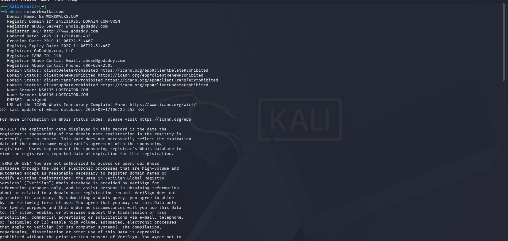
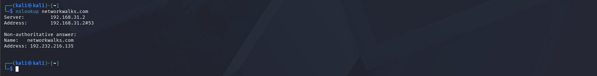
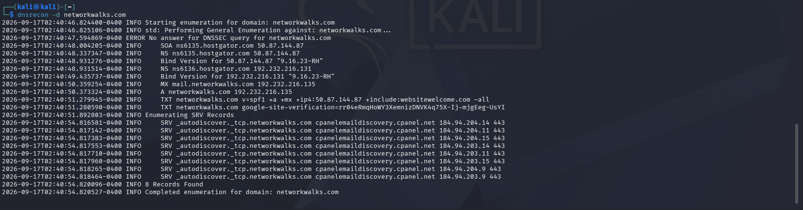
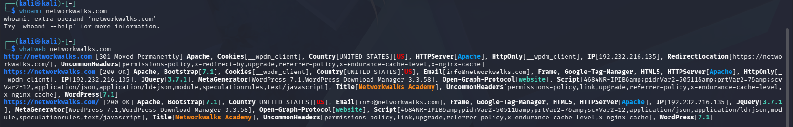
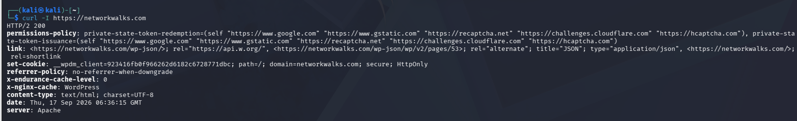
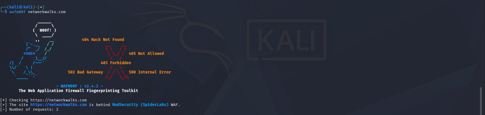
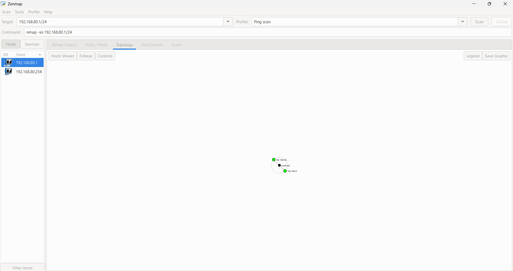

# PENETRATION TESTING REPORT

## FOOTPRINTING & RECONNAISSANCE

### W2-PM1 | CYBERSECURITY | NETWORKWALKS

**Pentester Name:** Srinivas Kalyan
**Program/Batch:** B083 - NetworkWalks
**Week:** 02
**Module:** W2-PM1
**Date:** September 2026

---

## 1. Client / Target

**Target:** `networkwalks.com`

The activities documented in this repository were performed as part of the authorized NetworkWalks cybersecurity training exercise.

---

## 2. Liability Disclaimer

All activities documented in this repository were performed as part of an authorized cybersecurity training exercise. The tools and techniques demonstrated here should only be used against systems where appropriate permission has been obtained.

This repository is intended for educational and cybersecurity learning purposes only.

---

## 3. Introduction

This report documents the practical activities completed as part of Week 2 – PM1 of the NetworkWalks Cybersecurity Internship.

The module focused on footprinting and reconnaissance of the authorized training target `networkwalks.com`.

The activities included WHOIS enumeration, DNS resolution, DNS enumeration, web technology identification, HTTP header analysis, Web Application Firewall detection, and network scanning using Zenmap.

All activities were performed using Kali Linux and authorized cybersecurity tools. The objective was to understand how information about a target can be collected and documented during the reconnaissance phase of a security assessment.

---

## 4. Tools Used

| Tool       | Purpose                                   |
| ---------- | ----------------------------------------- |
| Kali Linux | Cybersecurity testing environment         |
| WHOIS      | Domain registration information gathering |
| Nslookup   | DNS resolution                            |
| DNSRecon   | DNS record enumeration                    |
| WhatWeb    | Web technology identification             |
| cURL       | HTTP response header analysis             |
| WAFW00F    | Web Application Firewall detection        |
| Zenmap     | Network and service scanning              |

---

# 5. Activities Performed

## 5.1 WHOIS Enumeration

**Command Used:**

```bash
whois networkwalks.com
```

**Purpose:**

WHOIS was used to collect publicly available information about the target domain, including registrar information, domain dates, name servers and domain status information.

**Observations:**

The WHOIS query returned domain registration information including:

* Domain name
* Registrar information
* Domain creation date
* Domain update information
* Domain expiry information
* Name servers
* Domain status information

**Evidence:**



---

## 5.2 DNS Resolution Using Nslookup

**Command Used:**

```bash
nslookup networkwalks.com
```

**Purpose:**

Nslookup was used to resolve the target domain name and identify its associated IP address.

**Observation:**

The domain resolved to:

`192.232.216.135`

The DNS query was successfully completed and returned the target's IPv4 address.

**Evidence:**



---

## 5.3 DNS Enumeration Using DNSRecon

**Command Used:**

```bash
dnsrecon -d networkwalks.com
```

**Purpose:**

DNSRecon was used to enumerate DNS records associated with the target domain.

**Observations:**

The enumeration identified DNS information including:

* SOA records
* Name server records
* A records
* MX records
* TXT records
* SRV records

The identified name servers included:

* `ns6135.hostgator.com`
* `ns6136.hostgator.com`

The identified A record resolved to:

`192.232.216.135`

**Evidence:**



---

## 5.4 Web Technology Enumeration Using WhatWeb

**Command Used:**

```bash
whatweb networkwalks.com
```

**Purpose:**

WhatWeb was used to identify technologies and components associated with the target website.

**Observations:**

The scan identified web technologies and components including:

* Apache
* WordPress
* Bootstrap
* jQuery
* WordPress Download Manager
* HTTPS

The target IP identified during the enumeration was:

`192.232.216.135`

**Evidence:**



---

## 5.5 HTTP Header Analysis Using cURL

**Command Used:**

```bash
curl -I https://networkwalks.com
```

**Purpose:**

cURL was used to inspect the HTTP response headers returned by the target web server.

**Observations:**

The target returned an:

`HTTP/2 200`

response.

The response identified Apache as the web server and returned additional HTTP response headers and application-related information.

**Evidence:**



---

## 5.6 Web Application Firewall Detection Using WAFW00F

**Command Used:**

```bash
wafw00f networkwalks.com
```

**Purpose:**

WAFW00F was used to identify whether a Web Application Firewall was present in front of the target website.

**Observation:**

The tool identified:

`ModSecurity (SpiderLabs) WAF`

This indicates the presence of a Web Application Firewall protecting the web application.

**Evidence:**



---

## 5.7 Network Scanning Using Zenmap

**Tool Used:**

Zenmap (Nmap GUI)

**Purpose:**

Zenmap was used as part of the assigned cybersecurity practical to perform network scanning and service discovery.

**Target:**

`networkwalks.com`

**Activities Performed:**

* Network scanning
* Host discovery
* Port identification
* Service discovery
* Review of scan results

**Observation:**

The Zenmap scan results were reviewed to identify network information, available ports and detected services.

**Evidence:**



---

# 6. Overall Observations

The reconnaissance activities provided information about the target's publicly observable attack surface.

The following information was identified during the practical:

* Domain registration information
* Target IP address
* DNS records
* Name servers
* Web technologies
* Web server information
* HTTP response information
* Web Application Firewall information
* Network and service information through Zenmap

The reconnaissance results demonstrate how information can be collected from a target before performing further authorized security assessment activities.

These observations alone do not confirm the presence of vulnerabilities. Further authorized testing would be required to validate any potential security vulnerability.

---

# 7. Risk Analysis / Impact

The information collected during reconnaissance can provide useful intelligence about an organization's externally visible infrastructure.

| Observation                                 | Potential Security Impact                                                    |
| ------------------------------------------- | ---------------------------------------------------------------------------- |
| Domain information is publicly available    | May assist further reconnaissance                                            |
| DNS records are identifiable                | Can provide information about the target's infrastructure                    |
| Web technologies are identifiable           | May help identify technologies that require security monitoring and patching |
| HTTP server information is observable       | May provide information about the web infrastructure                         |
| WAF presence is identifiable                | Reveals that an application-layer security control is being used             |
| Network/service information is identifiable | Helps understand the externally observable network attack surface            |

These are security observations from the reconnaissance exercise and should not be interpreted as confirmed vulnerabilities.

---

# 8. Recommendations

1. Regularly review publicly exposed domain and DNS information.
2. Keep web applications, frameworks and plugins updated with appropriate security patches.
3. Review HTTP response headers and minimize unnecessary information disclosure where appropriate.
4. Maintain proper configuration and monitoring of the Web Application Firewall.
5. Regularly review externally exposed services and disable unnecessary services.
6. Perform periodic authorized security assessments to identify potential weaknesses.
7. Maintain clear documentation of authorized testing scope and security findings.
8. Perform reconnaissance and scanning only against systems for which appropriate authorization has been obtained.

---

# 9. Key Learning

Through this module, I gained practical experience in:

* Footprinting and reconnaissance
* WHOIS enumeration
* DNS resolution
* DNS enumeration
* DNS record analysis
* Web technology fingerprinting
* HTTP header analysis
* Web Application Firewall detection
* Network scanning using Zenmap
* Security evidence collection
* Technical cybersecurity documentation

The practical helped me understand how reconnaissance information can be collected and analyzed before deeper security testing is performed.

---

# 10. Conclusion

During Week 2 – PM1 of my NetworkWalks Cybersecurity Internship, I completed practical footprinting and reconnaissance activities against the authorized training target.

I used WHOIS, Nslookup, DNSRecon, WhatWeb, cURL and WAFW00F to collect information related to the domain, DNS infrastructure, web technologies, HTTP responses and Web Application Firewall.

I also completed the assigned Zenmap activity to gain practical experience with network scanning and service discovery.

This module helped me understand the importance of reconnaissance in cybersecurity and how security professionals document technical observations and evidence during an assessment.

I also learned that reconnaissance and scanning activities must always be performed within an authorized scope.

---

# 11. Evidence Collected

The following screenshots provide evidence of the practical activities completed during W2-PM1:

* **S1.png** – WHOIS Enumeration
* **S2.png** – Nslookup DNS Resolution
* **S3.png** – DNSRecon Enumeration
* **S4.png** – WhatWeb Technology Enumeration
* **S5.png** – cURL HTTP Header Analysis
* **S6.png** – WAFW00F Detection
* **S7.png** – Zenmap Network Scanning

---

## 👤 Author

**Srinivas Kalyan**
Cybersecurity Intern
NetworkWalks — Batch B083

**GitHub:** [Srinivas Kalyan](https://github.com/srinivaskalyansankuratri-lang)

---

## 📌 Project Information

**Program:** Cybersecurity Program at NetworkWalks
**Batch:** B083
**Week:** 02
**Module:** W2-PM1
**Project:** Footprinting & Reconnaissance

---
